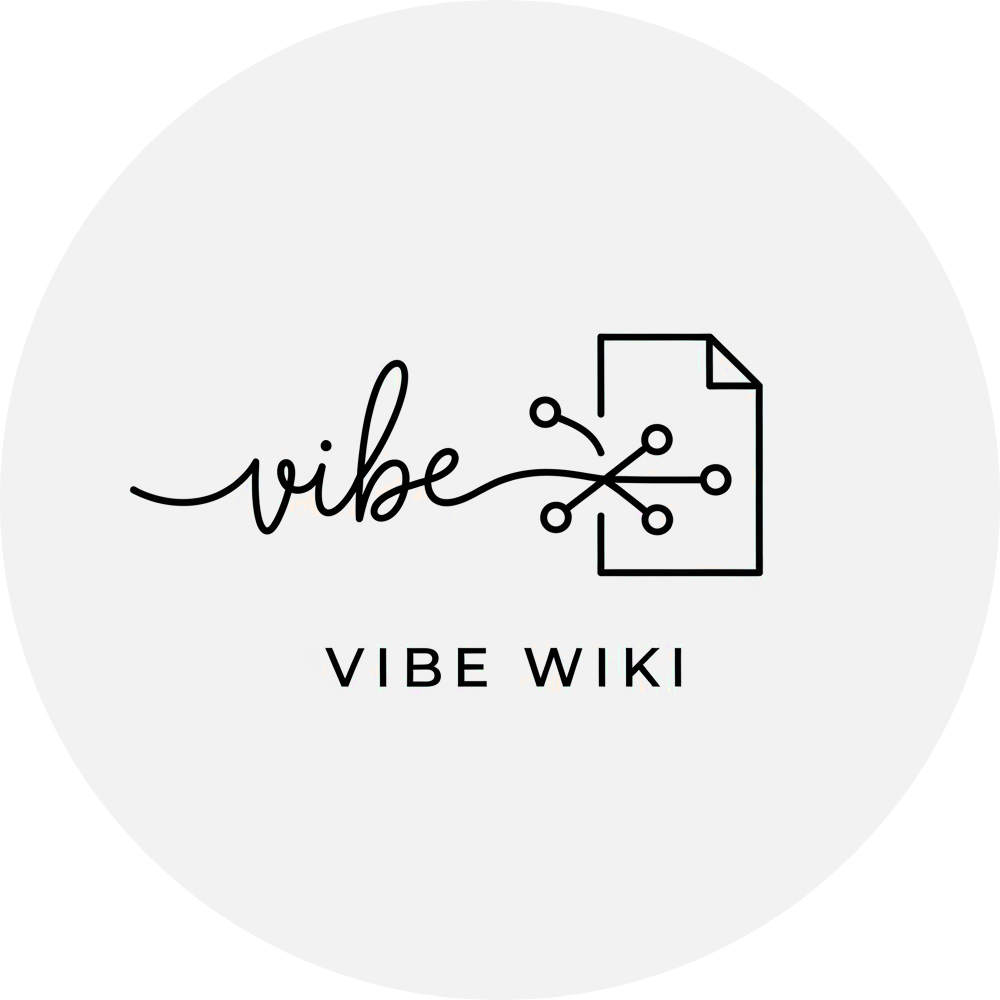

<h1 align="center">Vibe Wiki</h1>

Make your thoughts take shape. Vibe Wiki auto-generates the documents and diagrams you need from your handwritten notes and sketches.

## Overview

Vibe Wiki is a smart note-taking application designed to transform your raw handwritten ideas into polished, structured documents and editable diagrams. Capture your thoughts naturally, and let Vibe Wiki handle the organization and conversion.

## Features

* **Hand-drawn Diagram Conversion**: Intelligently interprets the structure of your hand-drawn diagrams (graphs, flowcharts, etc.) and exports them to editable formats compatible with tools like draw.io, Microsoft PowerPoint, and others.
* **Handwriting to Structured Documents**: Reorganizes and reframes your handwritten notes into a clean, wiki-style document format, making them easy to read, share, and manage.
* **Content Summarization & Visualization**: Provides concise summaries and visual representations of your note content to help you grasp key information quickly.

### Structure

**Name**          | **Description**           | **Link**
------------------|---------------------------|--------------
Web               | The web interface codes   | [./web](./web)
Server            | Python based server codes | [./server](./server)

## 🤝 Contributing

Details on contributing, coding standards, and the development process will be provided in `CONTRIBUTING.md`. (This file would need to be created).
